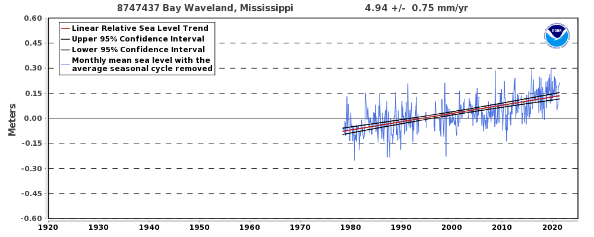
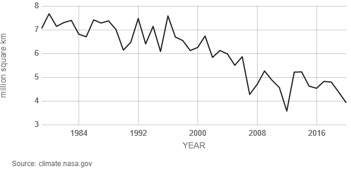

# Is it HOT out here, or is it just me?

The global warming debate has been raging on for a few decades now, but the idea has been around for over a century. "The theory that increases in greenhouse gases would lead to an increase in temperature was first proposed by the Swedish chemist Svante Arrhenius in 1896." [^1] Yet somehow there are still people out there who would choose to believe that the problem doesn't exist. With that said, it is our goal to show through visualizations (because seeing is believing) the affects that the rise in average temperature have on the world.

In this project we hope to present the issue at hand by focusing on the average rise in temperature around the world over the last 40 years and how it affects both the Arctic area covered in ice, as well as the change in sea levels around the United States.

One example of these claims is a line graph from NOAA (National Oceanic and Atmospheric Administration) showing the relative sea level trend in Mississippi, USA. [^2]

You can also see this in this graph from NASA showing the Arctic Sea Ice Minimum. This data was pulled from satellite observations between 1979-2020.[^3]
 

By no means do we think this class project is going to spark a revolution, but we do hope to help shed some light on a very serious situation.

[^1] Bodansky, Daniel (2001). "The History of the Global Climate Change Regime" (PDF). In Luterbacher, Urs; Sprinz, Detlef F. (eds.). International Relations and Global Climate Change. The MIT Press. pp. 23–40. Archived from the original (PDF) on 27 March 2014. Retrieved 22 November 2016
[^2] https://tidesandcurrents.noaa.gov/sltrends/sltrends_station.shtml?id=8747437
[^3] https://climate.nasa.gov/vital-signs/arctic-sea-ice/